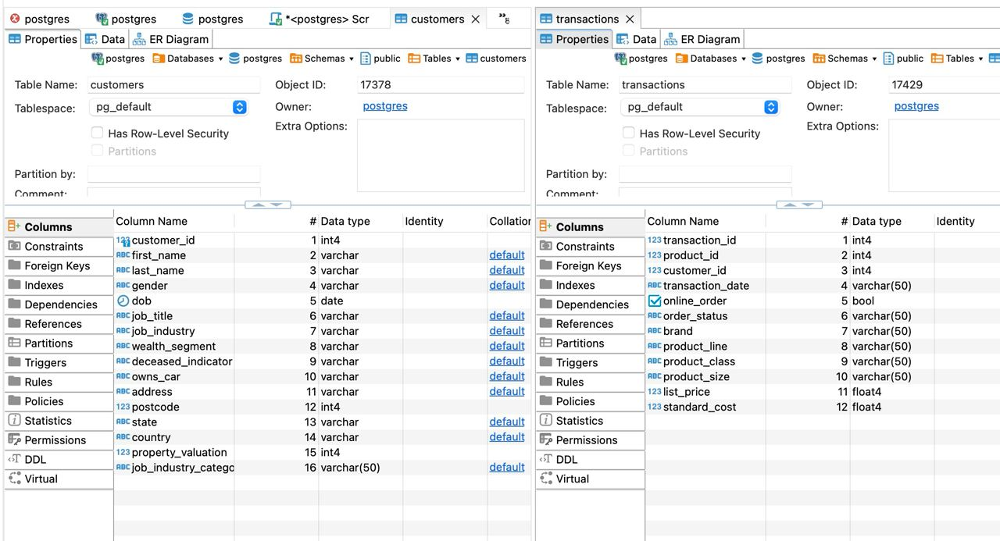
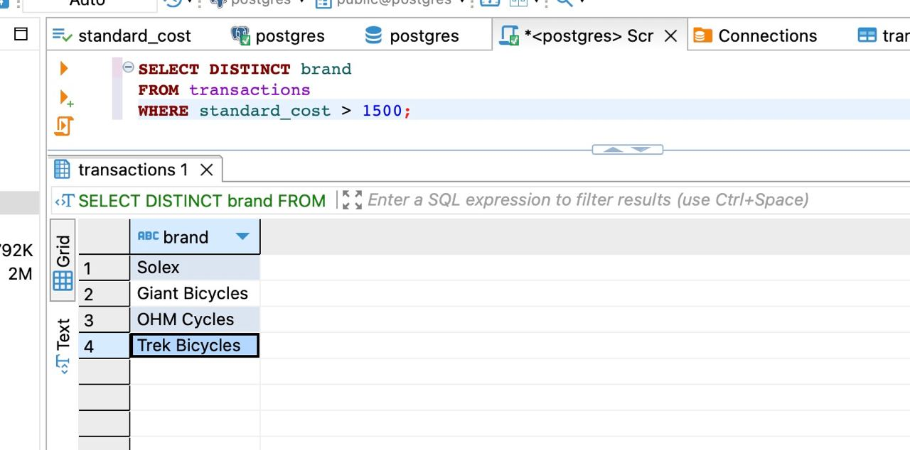
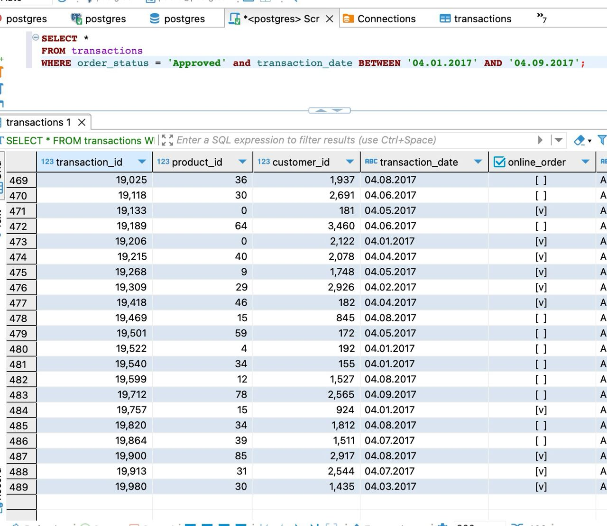
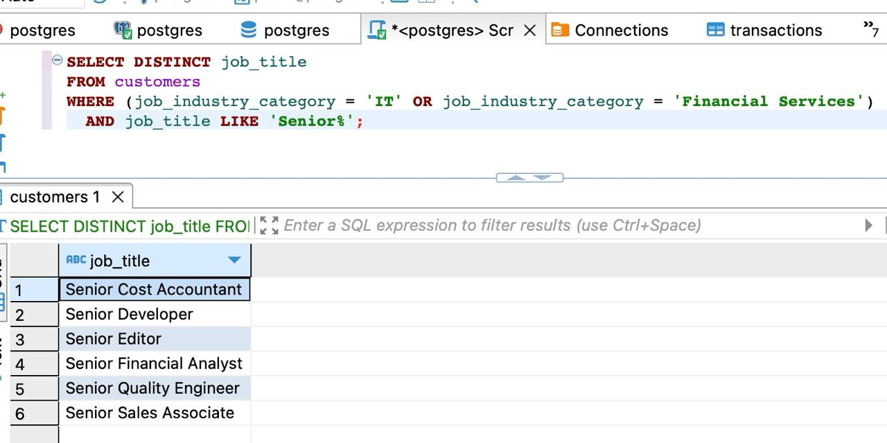
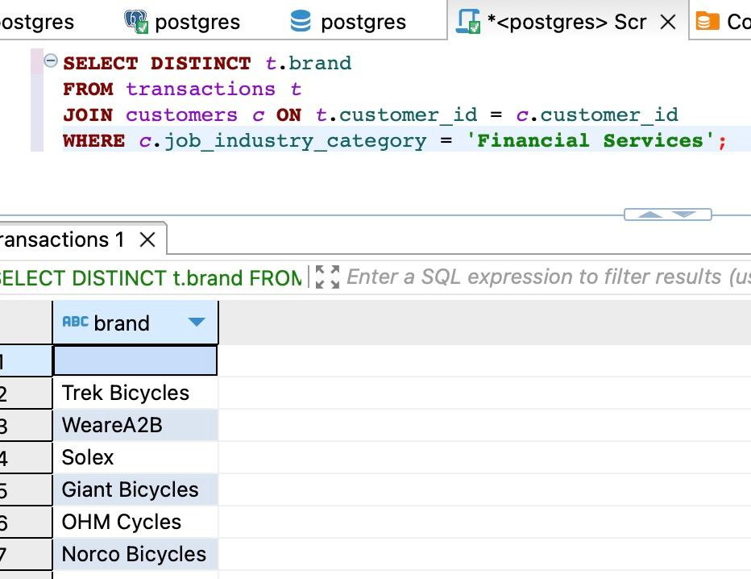
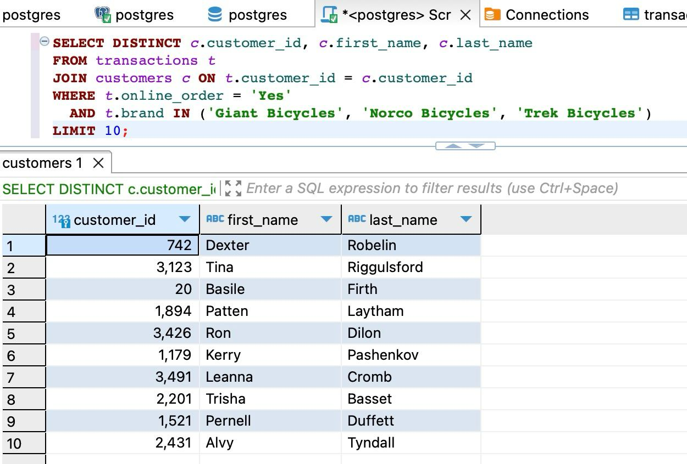
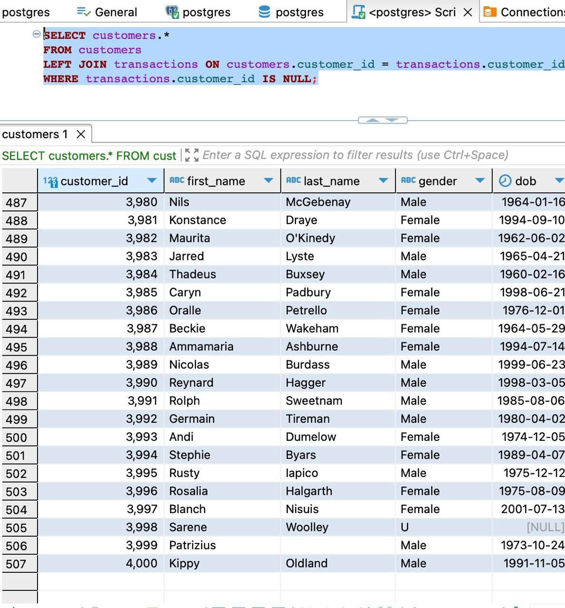
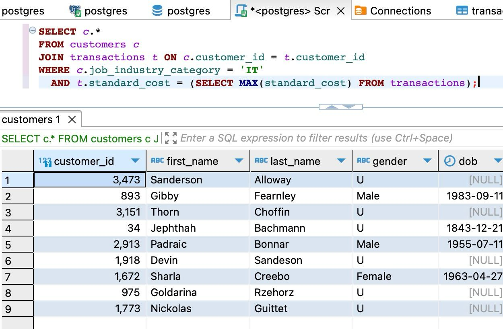
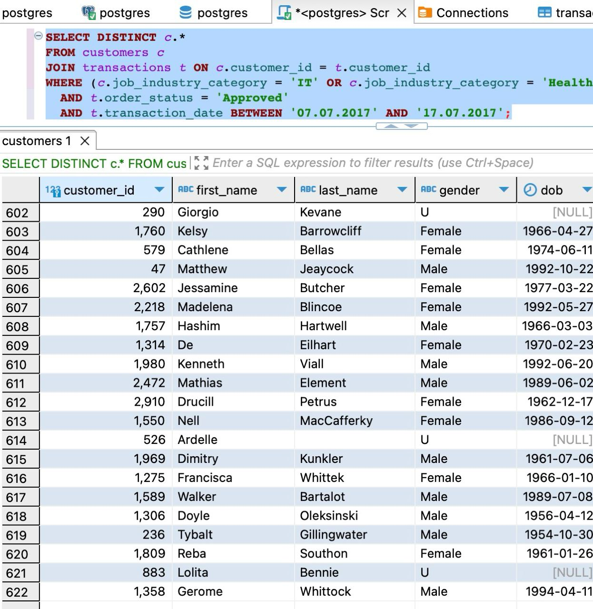

# Задание 2

## 1. Создать таблицы со следующими структурами и загрузить данные из csv-файлов. 

Таблицы были созданы, показаны на скриншоте ниже

## 2. Выполнить запросы

### 2.1 Вывести все уникальные бренды, у которых стандартная стоимость выше 1500 долларов.

### 2.2 Вывести все подтвержденные транзакции за период '2017-04-01' по '2017-04-09' включительно.

### 2.3 Вывести все профессии у клиентов из сферы IT или Financial Services, которые начинаются с фразы 'Senior'.

### 2.4 Вывести все бренды, которые закупают клиенты, работающие в сфере Financial Services

### 2.5 Вывести 10 клиентов, которые оформили онлайн-заказ продукции из брендов 'Giant Bicycles', 'Norco Bicycles', 'Trek Bicycles'.

### 2.6 Вывести всех клиентов, у которых нет транзакций.

### 2.7 Вывести всех клиентов из IT, у которых транзакции с максимальной стандартной стоимостью.

### 2.8 Вывести всех клиентов из сферы IT и Health, у которых есть подтвержденные транзакции за период '2017-07-07' по '2017-07-17'.

